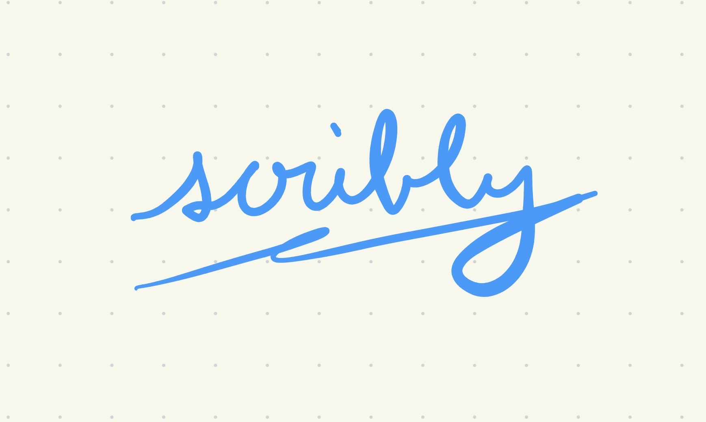

# Scribly: The Media Presentation Assistant



A computer vision-based media presentation assistant that allows you to control slides and annotate your screen using only hand gestures. This tool enables seamless, touchless interaction for presentations, lectures, or remote teaching, supporting both slide navigation and real-time drawing/annotation overlays.

## Features
- **Hand gesture-based slide navigation**: Swipe gestures to move slides forward or backward.
- **Air-writing annotation overlay**: Draw, erase, and clear annotations on a transparent overlay using pinch and fist gestures.
- **Full-screen, click-through overlay**: Annotations appear above all windows (where supported), without interfering with mouse or keyboard input.
- **Automatic clearing**: Overlay is cleared automatically when you swipe to a new slide.
- **Hotkeys**: Use `C` to clear the overlay, `Q` to quit.

## Installation

1. **Clone the repository**
   ```sh
   git clone https://github.com/wandouuu/scribly-htn2025
   cd hack-the-north-2025
   ```

2. **(Optional) Create a virtual environment**
   ```sh
   python3 -m venv .venv
   source .venv/bin/activate
   ```

3. **Install dependencies**
   ```sh
   pip install -r requirements.txt
   ```

## Usage

Run the main application:
```sh
python main.py
```

## Project Overview

### QNX Mode
- **video_transmission.py**: Gets the video stream over LAN from the Raspberry Pi (through a Raspberry Pi Camera Module 3).
- **main_rpi.py**: Processes the video stream and feeds it into main.py, which is lastly processed through MediaPipe.

### Webcam Mode
- **main.py**: Entry point. Launches the overlay and camera worker.
- **drawing.py**: Contains the `CamWorker` class for camera capture, gesture detection, and signal emission.
- **pose.py**: Contains the `OverlayWindow` class for drawing and erasing annotations.
- **connect.py**: (If present) May contain helper classes or functions for connecting overlay and camera logic.

###

## Notes
- On macOS, true system-wide overlays may be limited by OS security. The overlay works best on Windows, but most features are available cross-platform.
- Make sure your webcam is connected and accessible, or have a Raspberry Pi with QNX ready.
- For best results, use in a well-lit environment.

## License
MIT License.
